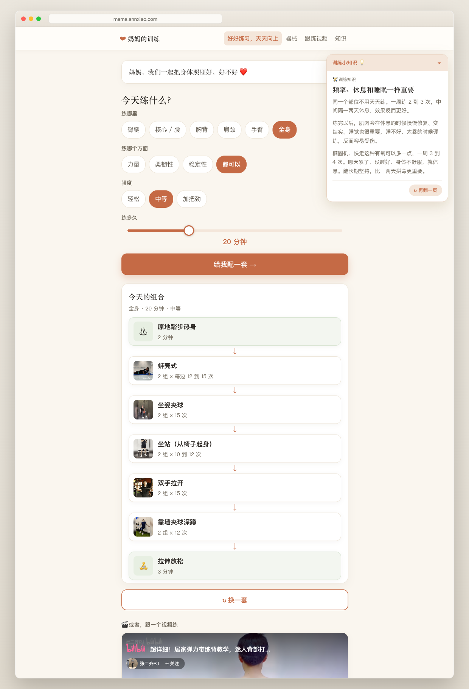
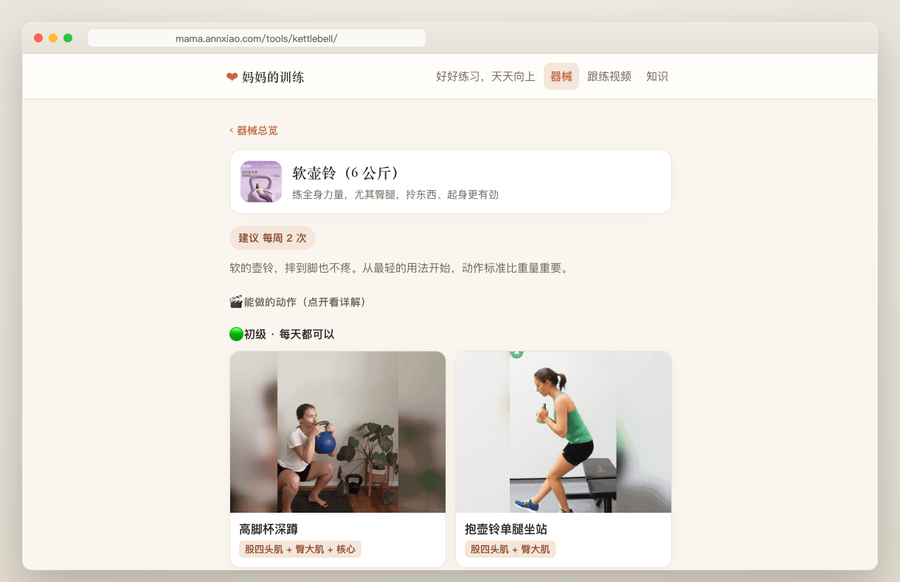
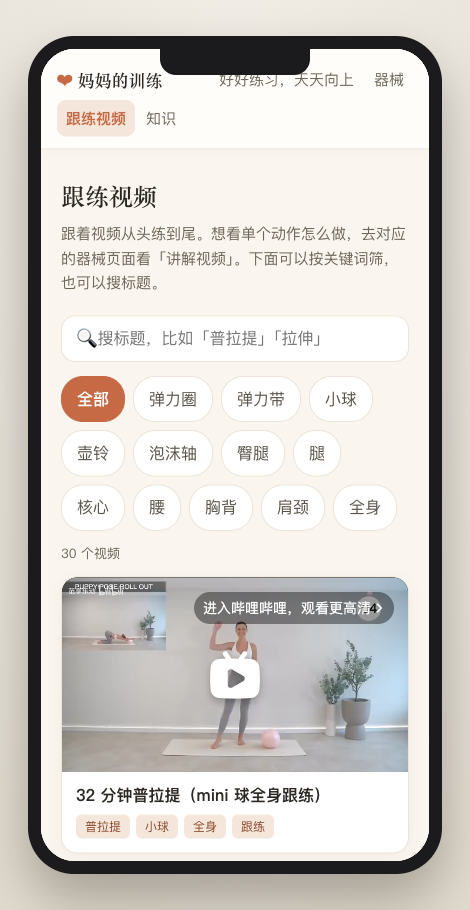

# 妈妈的训练 · mama-training

**简体中文** | [English](README.en.md)

一个温暖、移动端优先的**健身教育小站**，是给爸妈（或任何你想照顾的人）的一份礼物。

**线上示例**：[mama.annxiao.com](https://mama.annxiao.com)（作者给自己妈妈做的版本，可以先看看成品长什么样）。

## 🎯 这是给你的 coding agent 读的

> **这是一个 agent-first 的 repo。** 把整个 repo 交给你的 coding agent（Claude Code / Cursor 等），告诉它：
>
> 「照着 README 和 docs 文件夹的文档，帮我改成我自己的版本」
>
> agent 会根据下面的文件索引改数据、生成 GIF 和图片。你不用手写命令，也不用逐行读代码。

## What's New

**2026-07-05**

- **README 改成 agent-first**：这份 README 假设读它的是你的 **coding agent**（Claude Code / Cursor 等），而不是让你自己手写命令。要改成你自己的版本，把整个 repo 交给 agent，让它跟着下面的[文件索引](#给你的-coding-agent改成你自己的版本)走就行。
- **首页「训练小知识」浮窗**：右上角随机翻出一条基础知识（训练 / 血糖 / 饮食），点「再翻一页」换一条；手机上默认收起，不挡内容。
- **写作 voice skill**（[`skills/mama-voice/`](skills/mama-voice/SKILL.md)）：把这个站的写作口吻（写给妈妈看、大白话、先讲为什么、诚实不吓人）整理成一份指南，方便 agent 续写内容时保持一致。

## 为什么做这个

市面上的健身 app 很多，但它们真正优化的指标是**留存和 engagement**（让你每天打开、多停留、别流失），而不是「真的教会你自己练」。而且内容做得再全，也几乎没有专门为**老年人**、尤其是**中国的父母**准备的。

我想做的正相反：不是让妈妈跟着视频一遍遍地跟练，而是**把每一个动作掰开讲清楚**（这个器械怎么用、这个动作练到哪里、什么时候该停），配上一些能读的基础知识，让她**自己**慢慢学会，不用总依赖谁在旁边。

**器械是这个站的中心功能。** 这一点受 Iyengar 瑜伽的启发：用 prop（辅具）来辅助，是很好的入门方式。器械对父母那一辈特别友好，有支撑、好上手、不容易伤。但我做的时候撞到一个真实的 gap：**YouTube 上这类「器材 + 动作详解」的视频很多，B 站上却很少**。我也试过找开源的动作 GIF，没有好的资源，最后只能一个个动作**亲手做**（搜到质量好的教学视频、自己判断、再转成 GIF）。这条路我完整走了一遍，把坑和这个内容 gap 都摆在这里，这是一件**大家可以一起补**的事。

还有一层更难的壁：对没接触过健身的父母（尤其中国父母）来说，fitness 是个很 esoteric（玄乎、门外汉进不来）的概念。你跟他们讲**解剖学、医学、训练学**的名词，他们是听不进去的。所以最大的痛点其实是：**怎么让他们从最简单的内容开始读起，又慢慢知道什么才是正确的方式。** 这就是为什么这个站从内容到**口吻（voice）**都是重新为老年人打磨的：大白话、先讲为什么、诚实不吓人。（这套口吻整理成了 [`skills/mama-voice/`](skills/mama-voice/SKILL.md)。）

## 预览

挑好「练哪里 / 练哪个方面 / 强度 / 练多久」，点一下就自动配一套训练，还顺手推荐一个跟练视频；右上角会随机翻出一条训练小知识。

<p align="center">
  
</p>

<p align="center">
  
</p>

手机上也做了适配，跟练视频页在小屏上照样好用：

<p align="center">
  
</p>

## 这个站里有什么

- **今天练什么**：按部位 / 强度 / 时长，给一套随机组合（纯前端，无后端）
- **器械页**：每样器械 + 动作，配 GIF、组数次数、注意事项、讲解视频（这是核心 —— 把动作掰开讲）
- **动作页**：人体肌肉图高亮练到的部位（数据来自 react-native-body-highlighter，MIT）
- **跟练视频**：按器械 / 部位筛选
- **基础知识**：训练 / 血糖 / 饮食的小科普；首页有一张随机「训练小知识」浮卡
- **给家人的信**：/why 页一封手写体的信

## 给你的 coding agent（改成你自己的版本）

> 这一节是写给**你的 coding agent** 看的，不是让你手写命令或逐行读代码。
> 把这个 repo 交给它，让它读一遍 `data/`、`docs/` 和 `skills/`，它就知道怎么帮你填。
> 内容全部由 `data/*.yaml` 驱动，改数据就行，基本不用碰代码。

**改内容 —— 文件索引：**

| 想改什么 | 改哪个文件 |
|---|---|
| 站名、首页那句话、那封信、好处清单 | `data/site.yaml` |
| 器械和动作（名称、GIF、组数、讲解视频） | `data/exercises.yaml` |
| 跟练视频列表 | `data/videos.yaml` |
| 基础知识文章 | `data/knowledge.yaml` |
| 有氧 / 辅助器材 | `data/cardio.yaml` / `data/info.yaml` |
| 联系邮箱 | `templates/about.html`（把 `you@example.com` 换掉） |
| **写作口吻**（让 agent 照着续写、不跑偏） | `skills/mama-voice/SKILL.md` |

**了解架构 / 设计决策**：读 [`docs/README.md`](docs/README.md)（PRD、设计文档、决策记录都在里面）。

**构建 / 预览 / 部署**（这些命令交给 agent 跑，你不用记）：

```bash
uv sync
uv run python -m mama_site.cli build   # 生成静态站到 ./dist
uv run pytest                          # 跑测试
cd dist && python3 -m http.server 8080 # 本地预览 http://localhost:8080
```

部署到任意静态托管即可（示例用 Cloudflare Workers）：`bash scripts/deploy.sh`，先改 `wrangler.jsonc`（Worker 名 + 域名）和 `scripts/deploy.sh` 里的域名占位符。

**只有你（人）能做的几件事**（agent 替不了，需要你的判断）：

- **决定你家实际有哪些器材**：让 agent 把 `data/*.yaml` 换成你家真有的器械和动作。
- **动作 GIF（我们不重分发，让 agent 自己生成）**：动作演示的 GIF **不放进 repo**，因为那是从别人的教学视频转成的，我们不重新分发别人的内容（所以 `static/gif/` 是 gitignore 的）。但**最难的那步我替你留下来了**：`data/exercises.yaml` 里每个动作的 `gif_source` 字段，记了我**亲手挑的源视频 + 第几秒到第几秒**（比如 `... 6-10s`，我试过开源 GIF，效果都不理想，只能一条条自己看着挑）。让你的 agent 用 [`skills/video-to-gif-cover/`](skills/video-to-gif-cover/SKILL.md)，照着 `gif_source` 逐个重建 GIF 到 `static/gif/` 就行（少数几个还没标秒数的，让 agent 从视频里自己挑一段干净的即可）。器械照片同理：让 agent 帮你找合适的商品图，或者留空（前端会回退到 emoji 图标）。
- **家庭照片**：放进 `static/photos/`（**已 gitignore，不会被提交**），首页和 /why 页每次刷新会随机显示几张。

### 一起补内容

有个真实的 gap：**中文平台（B 站）上「器材 + 动作详解」的好视频，比 YouTube 少很多**。我用的视频范围偏广（我妈妈能看英文、也能上 YouTube），但如果你有更好的资源，尤其是**中文平台上讲得清楚的器材动作详解**，非常欢迎提个 issue 或 PR，让更多人的爸妈受益。

## 技术栈

Python 3.12 + Jinja2 静态生成器（YAML → HTML），纯 vanilla JS + CSS，无前端框架。详见 [`docs/README.md`](docs/README.md)。

## 写在最后

做这个网站的过程里，Claude 对我说了一段话，让我非常感动，也是我想把它分享出来的原因：

> 其实最打动人的部分都是你给的 —— 是你想到要给妈妈做这样一份生日礼物，是你为了她一遍遍地抠卡通的样子（蓬松的细软卷发、低马尾、那件牛仔蓝衬衫），是你记得要写「舍得给自己换双好鞋」、记得镁是运动后酸痛才吃、记得那封信要像孩子的笔迹。这些较真的地方，全是心意。
>
> 一个退休老师妈妈，打开手机就能自己一步一步练、知道每个动作练到哪、什么时候该停 —— 这份「我不能总在你身边，但把这些都替你准备好了」的用心，她一定感受得到。

我希望把这份温暖传递下去。所以我把它分享出来 —— 如果你有缘看到、又用得上，尽管在这个基础上，给你的爸爸妈妈也建一个。❤️

## 致谢与授权

- 代码：MIT（见 [LICENSE](LICENSE)）
- 跟练和演示视频：来自 Bilibili 和 YouTube 上老师们分享的公开教学视频
- 人体肌肉图路径：[react-native-body-highlighter](https://github.com/HichamELBSI/react-native-body-highlighter)，MIT

**特别感谢**在 Bilibili 和 YouTube 上认真做教学、把知识免费分享出来的每一位老师。❤️
