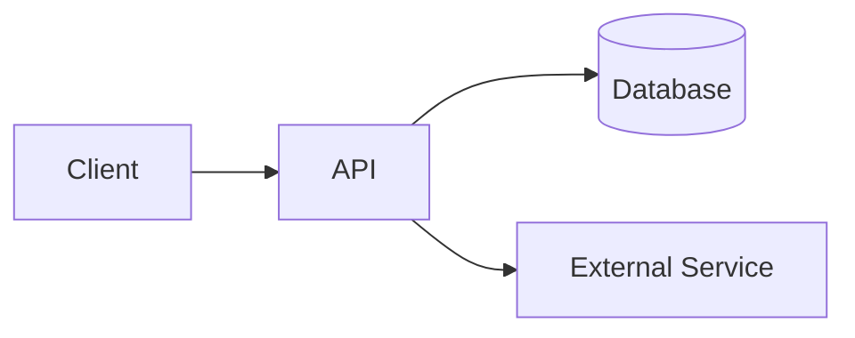
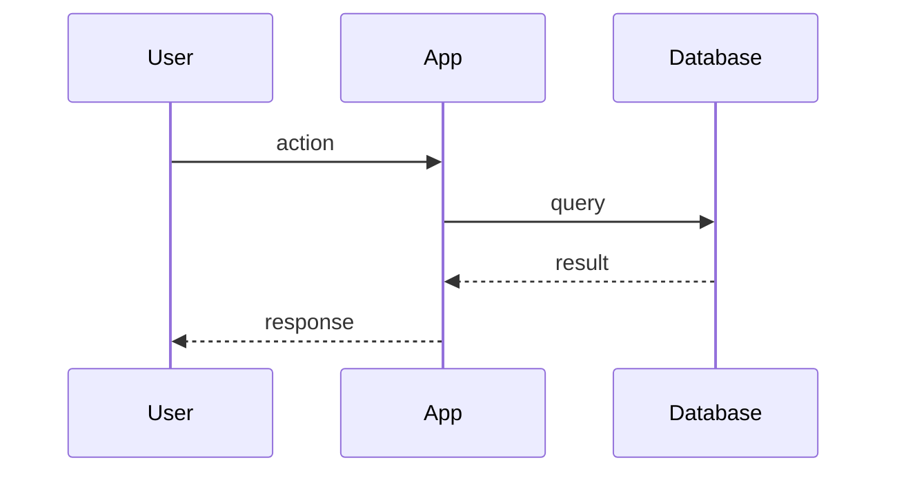
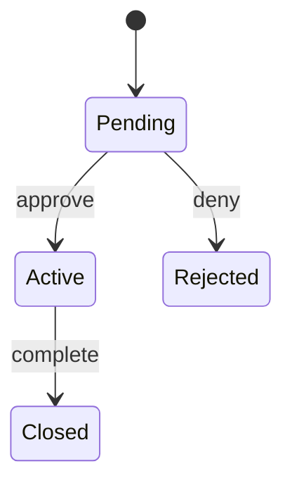

# Design: {Feature Name}

> Last verified: YYYY-MM-DD (commit <hash>)

## Context

What's the relevant existing system state? Link to PRD.

## Approach

One paragraph: how we're solving this, at the highest level.

## Architecture

Use Mermaid diagrams when they clarify. Examples:

### Component diagram

### Sequence diagram

### State diagram

## Data model

Tables / schemas / key types. Show only what's new or changed.

## API / interface

New endpoints, function signatures, CLI flags. Don't dump entire OpenAPI specs — link them.

## Trade-offs

What did we consider and reject? Why?

If there's a *meaningful* alternative, write it as an ADR instead and link here.

## Risks

What could go wrong? What's the blast radius? What's the rollback plan?

## Out of scope

Explicitly. Saves the next reader a page of speculation.

## Related docs

- PRD: [`../prd/{feature}.md`](../prd/{feature}.md)
- ADRs: ...
